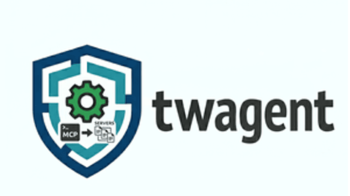

<p align="left">
  
</p>

Unified configuration framework for AI coding agents — Claude Code, Copilot CLI,
Pi, VS Code, opencode. **One canonical TOML, one CLI, two deploy modes.**

Replaces `twmcp` (MCP servers only) and `devops-binx/agent/render.py`
(instructions + skills) — both in a single TOML now.

## What you get

- **One config** at `~/.config/twagent/config.toml` describes every skill,
  subagent, prompt, instruction template, and MCP server you care about.
- **One CLI** (`twagent apply`) renders Jinja templates, symlinks file
  artifacts, and compiles MCP JSON in each agent's native shape.
- **Two deploy modes**: globally (each agent's default profile to
  `~/.claude/`, `~/.copilot/`, etc.) or locally (a CLI-supplied selection
  into the current directory).

```sh
twagent apply --global                          # sync everything globally
twagent apply -s tw-claude                      # local: drop a profile into cwd
twagent apply --global -s e2e-emea              # swap MCP env for the day
twagent apply --global -s e2e-emea -a copilot-cli  # one agent only
```

## Mental model

```
  ┌──────────────┐    ┌─────────────┐
  │  Registries  │ →  │   Profiles  │ →  apply (local | --global)
  │              │    │ (composable │        │
  │ instructions │    │   bundles)  │        ▼
  │ skills       │    │             │   per-agent paths
  │ subagents    │    │  extends... │   (global or cwd-relative)
  │ prompts      │    │             │
  │ servers      │    │             │
  └──────────────┘    └─────────────┘
```

- **Artifacts** live in registries — globally unique `name` + `source` path.
- **Profiles** bundle artifact references, composable via `extends`.
- **Agents** declare capabilities and per-kind paths (global *and* per-project).
- **`--select`** is polymorphic (profile or artifact names, mixed) and
  exhaustive (only kinds in the selection deploy).

## Install

```bash
uv tool install twagent
# or, from a clone:
make install
```

Python 3.13+. Optional: `fzf >= 0.35` improves the `--interactive` picker.

## First deploy

```sh
twagent edit --init                # bootstrap a commented starter config
$EDITOR ~/.config/twagent/config.toml
twagent apply --global -n          # preview
twagent apply --global             # deploy
```

→ Full walkthrough: [Quick Start](docs/quick-start.md) (10 min) and
[Tutorial](docs/tutorial.md) (30 min, two-agent setup).

## Documentation

| Read | When |
|---|---|
| [Overview](docs/overview.md) | What twagent is, who it's for, supported agents. |
| [Quick Start](docs/quick-start.md) | First deploy in 10 minutes. |
| [Tutorial](docs/tutorial.md) | Realistic two-agent setup with project overlay and MCP secrets. |
| [Reference: Commands](docs/reference/commands.md) | Every command, every flag. |
| [Reference: Configuration](docs/reference/config.md) | Full TOML schema with worked examples. |
| [FAQ](docs/faq.md) | Common questions and gotchas. |

## Develop

```sh
uv sync
make test
make format
make lint
make build
```

## License

BSD-3-Clause.
