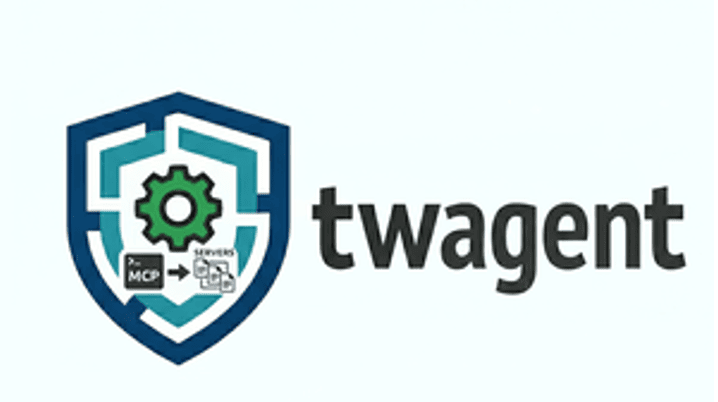

<p align="left">
  
</p>

Unified configuration framework for AI coding agents — Claude Code, Copilot CLI,
Pi, Codex, VS Code, opencode. **One canonical TOML, one CLI, two deploy modes.**

## What you get

- **One config** at `~/.config/twagent/config.toml` describes every skill,
  subagent, prompt, instruction template, and MCP server you care about.
- **One CLI** (`twagent apply`) renders Jinja templates, symlinks file
  artifacts, and compiles MCP configuration in each agent's native shape.
- **Runtime secrets** stay as `${VAR}` references (or Codex's environment-backed
  fields), so `twagent` never writes resolved credentials.
- **Two deploy modes**: globally (each agent's default profile to
  `~/.claude/`, `~/.copilot/`, etc.) or locally (into the current directory).
- **Deduplicated end to end**: an artifact reaches an agent exactly once, no
  matter how many profiles ask for it — overlapping bundles never cost you
  context window. See [Deduplication](#deduplication).

```sh
twagent apply --global                          # sync everything globally
twagent apply -s tw-claude                      # local: drop a profile into cwd
twagent apply --global -s e2e-emea              # swap MCP env for the day
twagent apply --global -s e2e-emea -a copilot-cli  # one agent only
```

## Mental model

```
  ┌──────────────┐    ┌─────────────┐
  │  Registries  │ →  │   Profiles  │ →  apply (local | global)
  │              │    │ (composable │        │
  │ instructions │    │   bundles)  │        ▼
  │ skills       │    │             │   per-agent paths
  │ subagents    │    │  extends... │   (global or cwd-relative)
  │ prompts      │    │             │
  │ servers      │    │             │
  └──────────────┘    └─────────────┘
```

- **Artifacts** live in registries — globally unique `name` + `source` path.
- **Profiles** bundle artifact references, composable via `extends`.
- **Agents** declare capabilities and per-kind paths (global *and* per-project).
- **`global_profile`** is the bridge: each agent names exactly one profile as
  its default loadout. When you run `twagent apply --global`, the agent's
  `global_profile` is resolved (including all `extends` chains) and the
  resulting artifacts are deployed to the agent's `paths.global.*` locations.
- **`--select`** is polymorphic (profile or artifact names, mixed) and
  exhaustive (only kinds in the selection deploy).

### How `global_profile` works

```toml
[agents.copilot-cli]
global_profile = "tw-copilot"   # ← this is the default loadout

[profiles.tw-copilot]
extends      = ["core", "pr_review", "web_research"]
instructions = ["AGENT-md"]

[profiles.core]
skills = ["bkmr-memory", "twmux", "skill-creator", "tw-comprehend"]

[profiles.pr_review]
skills = ["tw-review", "tw-add-pr-review", "tw-check-pr"]
```

Running `twagent apply --global` resolves the full `extends` tree and deploys
all referenced skills, instructions, and servers to the agent's global paths.
Each agent can have a **different** `global_profile`, so Claude, Copilot, and
Pi can share profiles (via `extends`) while each carrying a distinct default
set.

Without a `global_profile`, `apply --global` skips that agent entirely — it
only deploys agents that declare one.

## Deduplication

Profiles are meant to overlap. Two bundles that both want `tw-ai-add` is a
feature, not a mistake — so twagent guarantees the artifact reaches the agent
**once**. Every duplicate skill an agent loads is a skill description burnt in
its context window for nothing.

```toml
[profiles.wiki]
skills = ["tw-ai-add", "twiki-query", "twiki-lint", "twiki-ingest", "tw-aws-add"]

[profiles.core]
skills = ["twmux", "skill-creator", "bkmr-memory", "tw-ai-add", "tw-aws-add"]
```

```sh
$ twagent apply -s wiki,core
# 10 references in → 8 skills resolved. tw-ai-add and tw-aws-add collapse.
# (Locally, layer 3 below may then drop more: whatever is already global.)
```

Four layers, each doing a different job:

| # | Collapses | When |
|---|---|---|
| 1 | Repeats inside one `extends` tree, including plugin members | Always. Depth-first, parent-first, **first occurrence wins**; a `visited` set makes diamond inheritance and cycles safe. |
| 2 | Repeats across several `--select` names | Always. Profiles, plugins and bare artifact names merge into one first-seen-wins list per kind. |
| 3 | A project copy of something already deployed globally | Local `apply` only, **on by default**. Agents read both layers, so a local copy of a global skill is loaded twice. `--no-dedup` forces the local copy. |
| 4 | Anything that survived 1–3 | Always. Deploy is keyed by artifact name, and the name *is* the symlink name — one directory entry per name, by construction. |

Layers 1, 2 and 4 are unconditional; there is no flag to switch them off.
Layer 3 is the one that saves real context, and the only one you can opt out of:

```sh
twagent apply -s wiki            # skips skills already in ~/.claude/skills
twagent apply -s wiki --no-dedup # deploys them locally anyway
twagent apply -s wiki -n         # dry run: prints what dedup skipped
```

Two things are deliberately **not** deduplicated: MCP configuration and
instruction templates. Both are merged or rendered files rather than directories
of symlinks, so "the same one twice" is not a state they can reach.

→ Details: [Dedup against the global
layer](docs/reference/commands.md#dedup-against-the-global-layer) and
[Composition semantics](docs/overview.md).

## Install

```bash
uv tool install twagent
# or, from a clone:
make install
```

Python 3.13+. Optional: `fzf >= 0.35` improves the `--interactive` picker.

## First deploy

```sh
twagent edit --init                # bootstrap a commented starter config
$EDITOR ~/.config/twagent/config.toml
twagent apply --global -n          # preview
twagent apply --global             # deploy
```

→ Full walkthrough: [Quick Start](docs/quick-start.md) (10 min) and
[Tutorial](docs/tutorial.md) (30 min, two-agent setup).

## Documentation

| Read | When |
|---|---|
| [Overview](docs/overview.md) | What twagent is, who it's for, supported agents. |
| [Quick Start](docs/quick-start.md) | First deploy in 10 minutes. |
| [Tutorial](docs/tutorial.md) | Realistic two-agent setup with project overlay and MCP secrets. |
| [Reference: Commands](docs/reference/commands.md) | Every command, every flag. |
| [Reference: Configuration](docs/reference/config.md) | Full TOML schema with worked examples. |
| [FAQ](docs/faq.md) | Common questions and gotchas. |

## Develop

```sh
uv sync
make test
make format
make lint
make build
```

## License

BSD-3-Clause.
